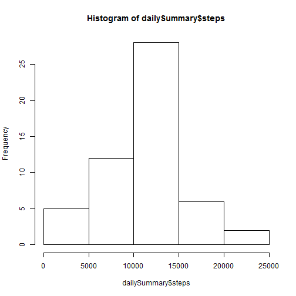
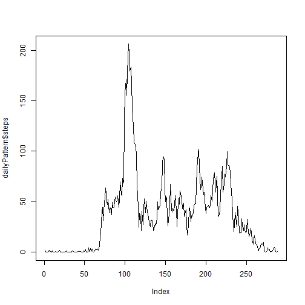
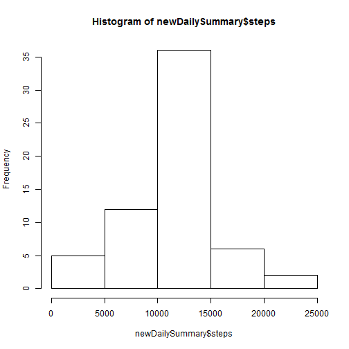
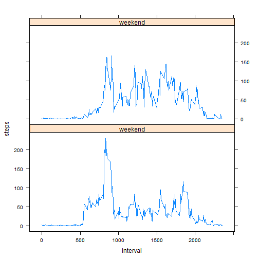

# Reproducible Research: Peer Assessment 1


## Loading and preprocessing the data
First, unzip the data and load the dataset

```r
unzip("activity.zip")
activity <- read.csv("activity.csv")
```
Import data.table library and create new data table for better data handling

```r
install.packages("data.table")
```

```
## Installing package into 'C:/Users/pdizo/Documents/R/win-library/3.1'
## (as 'lib' is unspecified)
```

```
## Error: trying to use CRAN without setting a mirror
```

```r
library(data.table)
```

```
## Warning: package 'data.table' was built under R version 3.1.1
```

```r
activityDT <- data.table(activity)
```

## What is mean total number of steps taken per day?
Using data.table .SD notation for subset, we can easily calculate the mean and median for the total number of steps per day and plot histogram.

```r
dailySummary <- activityDT[, lapply(.SD, sum), by = date]
outMean <- mean(dailySummary$steps, na.rm=TRUE)
outMedian <- median(dailySummary$steps, na.rm=TRUE)

# plot histogram
hist(dailySummary$steps)
```

 

The mean total number of steps taken per day is 1.0766 &times; 10<sup>4</sup>.  
The median total number of steps taken per day is 10765.


## What is the average daily activity pattern?
Again, we will use the .SD notation to calculate the averages.


```r
dailyPattern <- activityDT[, lapply(.SD, mean, na.rm = TRUE), by = interval]
plot(dailyPattern$steps,type = "l")
```

 

```r
maxInterval <- dailyPattern$interval[which.max(dailyPattern$steps)]
```
Interval with the maximum average numberof steps is 835.


## Imputing missing values
First, let's calculate the total number of NAs

```r
naCount <- sum(is.na(activity$steps))
```
The total number of NAs in the dataframe is 2304.  
Now, we will use the dailyPattern table with average number of steps for each interval to fill in the missing values as it already contains the average number of steps calculated for each interval. 


```r
newActivity <- activity
for(i in 1:17568){
  if(is.na(newActivity$steps[i])){
    newActivity$steps[i] <- dailyPattern$steps[dailyPattern$interval == newActivity$interval[i]]
  }
}
```
Now we can just reproduce the steps from the first part of assignment

```r
newActivityDT <- data.table(newActivity)
newDailySummary <- newActivityDT[, lapply(.SD, sum), by = date]
newMean <- mean(newDailySummary$steps, na.rm=TRUE)
newMedian <- median(newDailySummary$steps, na.rm=TRUE)

# plot histogram
hist(newDailySummary$steps)
```

 

New mean total number of steps taken per day is 1.0766 &times; 10<sup>4</sup>.  
New median total number of steps taken per day is 1.0766 &times; 10<sup>4</sup>.

We can observe that the mean has not changed and the median is one step higher than before. This can be easily explained because as we added more mean values the median shifted more towards the mean. 


## Are there differences in activity patterns between weekdays and weekends?
Firstly, let's create weekend factor

```r
newActivity$weekend <- as.factor(ifelse(weekdays(as.Date(newActivity$date)) %in% c("Sunday", "Saturday"), "weekend", "weekday"))
```
Now we are ready to create the final plot

```r
library(lattice)
weekend <- data.table(newActivity[newActivity$weekend == "weekend",])
weekday <- data.table(newActivity[newActivity$weekend == "weekday",])

weekend <- weekend[, lapply(.SD, mean, na.rm = TRUE), by = interval]
weekday <- weekday[, lapply(.SD, mean, na.rm = TRUE), by = interval]
newData <- rbind(weekend,weekday)
lbl <- rbind("weekend","weekday")
f <- factor(newData$weekend, labels = c("Weekday", "Weekend"))
xyplot(steps ~ interval | f, data = newData, layout = c(1, 2), type = "l")
```

 


